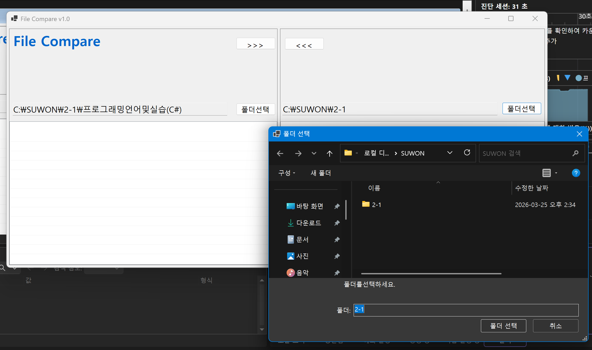
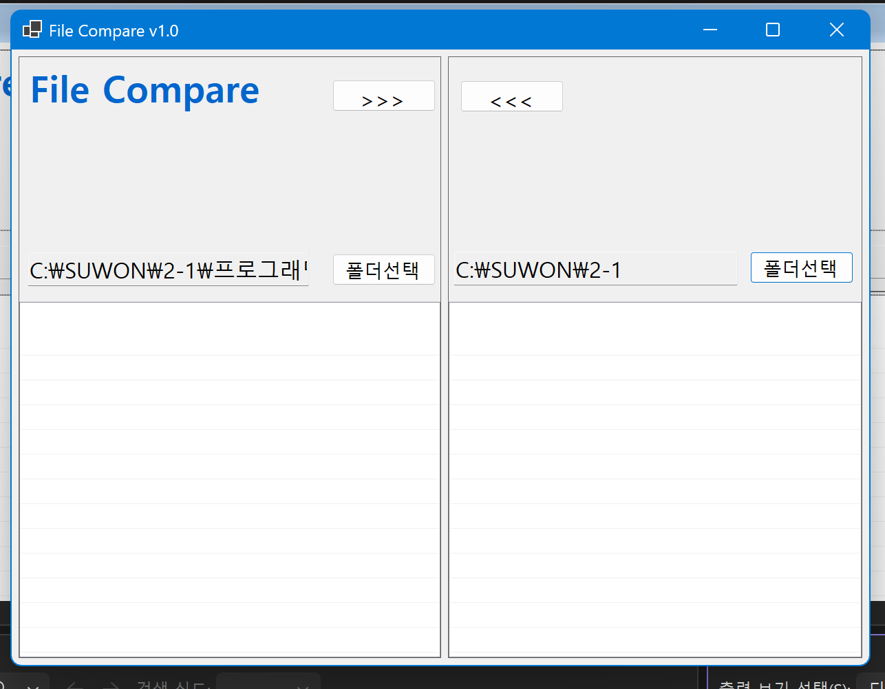
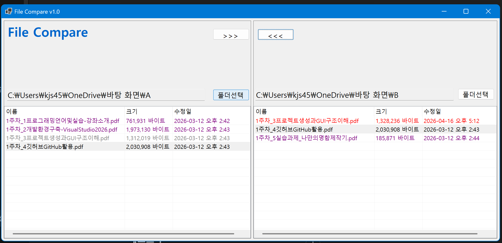
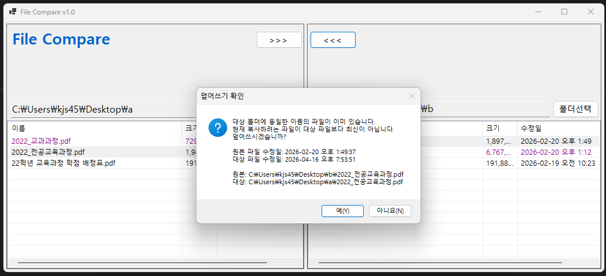
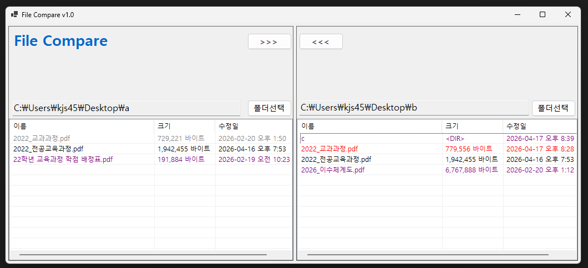
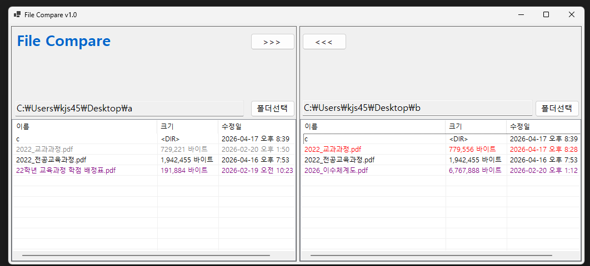

# (C# 코딩) File Compare

## 개요
- C# 프로그래밍 학습을 위해 Windows Forms로 구현한 파일 비교 도구입니다.
- 1줄 소개: 두 개의 폴더를 선택하여 파일과 하위폴더를 비교하고, 최신 파일을 기준으로 반대편 폴더로 복사할 수 있는 프로그램입니다.
- 사용한 플랫폼:
- C#, .NET Windows Forms, Visual Studio, GitHub

- 사용한 컨트롤:
- SplitContainer
- Panel
- Label
- TextBox
- Button
- ListView
- FolderBrowserDialog

- 사용한 기술과 구현한 기능:
- SplitContainer를 이용하여 좌우 비교 화면을 나누고, Panel로 상단 제목 영역, 경로 표시 영역, 파일 목록 영역을 구조화하였습니다.
- Dock 속성을 사용하여 화면 크기에 맞춰 컨트롤이 자연스럽게 배치되도록 구성하였습니다.
- Anchor 속성을 사용하여 창 크기가 변경되어도 경로 표시 TextBox와 버튼 위치가 무너지지 않도록 고정하였습니다.
- FolderBrowserDialog를 사용하여 왼쪽 폴더와 오른쪽 폴더를 각각 선택할 수 있도록 구현하였습니다.
- Directory.EnumerateFiles, Directory.EnumerateDirectories, FileInfo, DirectoryInfo를 이용하여 폴더 안의 파일과 하위폴더 정보를 읽어오도록 구현하였습니다.
- ListView를 Details 보기 형식으로 설정하고 이름, 크기, 수정일 정보를 표 형태로 출력하도록 구성하였습니다.
- 같은 이름의 파일과 폴더를 수정 시간 기준으로 비교하여 동일, 최신(New), 이전(Old), 단독 항목 상태를 구분하도록 구현하였습니다.
- 비교 결과를 색상으로 표시하여 최신 항목은 빨간색, 오래된 항목은 회색, 동일 항목은 검정색, 한쪽에만 존재하는 항목은 보라색으로 표현하도록 구현하였습니다.
- 선택한 파일을 반대편 폴더로 복사할 수 있도록 구현하였습니다.
- 동일한 이름의 파일이 이미 존재하는 경우 수정 시간을 비교하여, New 파일에서 Old 파일로 복사할 때는 바로 덮어쓰고, Old 파일에서 New 파일로 복사하거나 같은 수정 시간의 파일을 덮어쓸 때는 확인 메시지가 표시되도록 구현하였습니다.
- 하위폴더를 하나의 비교 항목처럼 표시하고, 복사 버튼 클릭 시 하위폴더 내부의 모든 파일과 하위폴더를 재귀적으로 복사하도록 구현하였습니다.
- 하위폴더 복사 후 대상 폴더의 수정 시간을 원본과 같게 맞추어, 복사 완료 후 동일한 폴더가 검정색으로 표시되도록 처리하였습니다.
- try-catch 구문을 사용하여 폴더 경로 오류나 입출력 오류가 발생했을 때 프로그램이 종료되지 않고 안내 메시지가 표시되도록 구현하였습니다.

- 핵심 기능:
- 좌우 폴더 선택
- 파일 및 하위폴더 목록 표시
- 파일/폴더 비교 및 상태 색상 표시
- 선택 파일 복사
- 덮어쓰기 확인 처리
- 하위폴더 전체 재귀 복사
- 복사 후 목록 및 비교 결과 자동 갱신

- 화면 구성:
- 상단에는 앱 이름을 표시하는 Label을 배치하였습니다.
- 중앙 화면은 SplitContainer를 사용하여 왼쪽 폴더와 오른쪽 폴더 비교 영역으로 나누었습니다.
- 각 영역 상단에는 폴더 경로를 표시하는 TextBox와 폴더 선택 Button을 배치하였습니다.
- 각 영역 하단에는 파일과 폴더 정보를 표 형태로 표시하는 ListView를 배치하였습니다.
- 중앙에는 왼쪽에서 오른쪽으로 복사하는 버튼과 오른쪽에서 왼쪽으로 복사하는 버튼을 배치하였습니다.

## 실행 화면 (과제1)
- 과제1 코드의 실행 스크린샷

- 과제 내용
- File Compare 앱의 기본 UI를 구성하고 컨트롤의 이름과 기본 속성을 설정하였습니다.
- SplitContainer를 사용하여 화면을 좌우 비교 영역으로 나누고, 각 영역을 Panel로 구분하여 제목, 경로 표시, 파일 목록 영역이 정리되도록 구성하였습니다.
- Label, TextBox, Button, ListView를 설계도에 맞게 배치하였습니다.
- Anchor 속성을 사용하여 창 크기가 변경되어도 TextBox와 버튼의 위치가 자연스럽게 유지되도록 설정하였습니다.
- 폴더 선택 버튼 클릭 시 FolderBrowserDialog가 열리고 선택한 경로가 TextBox에 표시되도록 구현하였습니다.

- 구현 내용과 기능 설명
- 상단에는 앱 이름을 표시하는 Label을 배치하고, 중앙에는 좌우 복사 버튼을 배치하여 전체 화면 구조를 구성하였습니다.
- 왼쪽과 오른쪽 영역 각각에 경로 표시용 TextBox와 폴더 선택 버튼을 배치하였습니다.
- 하단에는 파일 목록을 표 형태로 보여주기 위한 ListView를 좌우 각각 배치하였습니다.
- ListView는 Details 보기 형식으로 설정하고, 이름/크기/수정일 열을 표시할 수 있도록 기본 구성을 완료하였습니다.
- Dock 속성을 사용하여 SplitContainer와 Panel, ListView가 부모 영역에 맞게 정렬되도록 설정하였습니다.
- Anchor 속성을 이용하여 창 크기 변경 시 경로 TextBox는 가로 길이가 함께 늘어나고 버튼은 지정한 위치를 유지하도록 설정하였습니다.
- 왼쪽 폴더선택 버튼과 오른쪽 폴더선택 버튼 클릭 시 FolderBrowserDialog가 열리도록 구현하였습니다.
- 사용자가 폴더를 선택하면 선택한 경로가 각 TextBox에 표시되도록 구현하였습니다.
- 기본 UI 구조와 폴더 선택 기능까지 실행 테스트를 완료하였습니다.

## 실행 화면 (과제2)
- 과제2 코드의 실행 스크린샷

- 과제 내용
- 양쪽 폴더의 파일 정보를 ListView에 표시하고, 같은 이름의 파일을 수정 시간 기준으로 비교하여 상태를 구분하도록 구현하였습니다.
- 비교 결과를 색상으로 표시하여 동일 파일, 최신 파일, 오래된 파일, 한쪽에만 있는 파일을 쉽게 구분할 수 있도록 구성하였습니다.

- 구현 내용과 기능 설명
- Directory.EnumerateFiles와 FileInfo를 사용하여 각 폴더 안의 파일 목록을 읽어오도록 구현하였습니다.
- ListView에 파일 이름, 크기, 수정일 정보를 행 단위로 출력하도록 구현하였습니다.
- 파일 목록은 이름 기준으로 정렬하여 표시되도록 처리하였습니다.
- 양쪽 폴더의 파일을 파일 이름으로 비교하고, 같은 이름의 파일은 수정 시간을 기준으로 상태를 판별하도록 구현하였습니다.
- 동일한 파일은 검은색, 더 최신인 파일은 빨간색, 더 오래된 파일은 회색으로 표시되도록 구현하였습니다.
- 한쪽 폴더에만 존재하는 단독 파일은 보라색으로 표시되도록 구현하였습니다.
- 파일 목록 표시와 색상 구분 기능까지 실행 테스트를 완료하였습니다.

## 실행 화면 (과제3)
- 과제3 코드의 실행 스크린샷

- 과제 내용
- 양쪽 폴더 사이에서 선택한 파일을 반대편 폴더로 복사할 수 있도록 구현하였습니다.
- 수정 날짜를 기준으로 덮어쓰기 여부를 다르게 처리하여 최신 파일과 오래된 파일 복사 흐름을 구분하도록 구성하였습니다.

- 구현 내용과 기능 설명
- 왼쪽 ListView에서 선택한 파일을 오른쪽 폴더로 복사하는 기능을 구현하였습니다.
- 오른쪽 ListView에서 선택한 파일을 왼쪽 폴더로 복사하는 기능을 구현하였습니다.
- 복사 대상에 동일한 이름의 파일이 없는 경우에는 바로 복사되도록 처리하였습니다.
- 원본 파일이 대상 파일보다 더 최신인 경우(New 파일에서 Old 파일로 복사)에는 확인 메시지 없이 바로 덮어쓰기되도록 구현하였습니다.
- 원본 파일이 대상 파일보다 오래되었거나 같은 경우(Old 파일에서 New 파일로 복사 포함)에는 반드시 확인 메시지가 표시되도록 구현하였습니다.
- 확인창에 원본 파일과 대상 파일의 수정 날짜 정보를 함께 표시하여 사용자가 비교 후 진행 여부를 선택할 수 있도록 처리하였습니다.
- 아니오를 선택한 경우에는 복사가 진행되지 않도록 구현하였습니다.
- 파일 복사 후 양쪽 ListView를 다시 갱신하고 비교 결과 색상이 최신 상태로 반영되도록 처리하였습니다.
- 파일 복사 및 덮어쓰기 조건 분기 기능까지 실행 테스트를 완료하였습니다.

## 실행 화면 (과제4)
- 과제4 코드의 실행 스크린샷

- 과제 내용
- 하위폴더를 하나의 비교 항목처럼 표시하고, 하위폴더까지 포함하여 비교 및 복사가 가능하도록 기능을 확장하였습니다.
- 복사 버튼 클릭 시 폴더 안의 모든 파일과 하위폴더가 재귀적으로 처리되도록 구현하였습니다.

- 구현 내용과 기능 설명
- Directory.EnumerateDirectories와 DirectoryInfo를 사용하여 하위폴더 목록을 읽어오고, 파일보다 먼저 ListView에 표시되도록 구현하였습니다.
- 하위폴더는 크기 대신 `<DIR>` 표시가 나오도록 구성하였습니다.
- 파일뿐 아니라 폴더도 같은 이름과 수정 시간을 기준으로 비교하여 동일, 최신(New), 오래된(Old), 단독 항목 상태를 색상으로 구분하도록 구현하였습니다.
- 선택한 항목이 폴더일 경우에는 재귀 복사 메서드를 사용하여 하위폴더 내부의 모든 파일과 하위폴더까지 복사되도록 구현하였습니다.
- 하위폴더 내부 파일 복사에도 기존 파일 복사 규칙을 그대로 적용하여 New 파일에서 Old 파일로 복사할 때는 확인 없이 바로 덮어쓰기되도록 처리하였습니다.
- Old 파일에서 New 파일로 복사하거나 같은 수정 시간의 파일을 덮어쓸 때는 기존처럼 확인 메시지가 표시되도록 유지하였습니다.
- 하위폴더 복사 후 대상 폴더의 수정 시간을 원본 폴더와 같게 맞추어 복사 완료 후 동일 상태일 때 양쪽 폴더가 검정색으로 표시되도록 수정하였습니다.
- 복사 완료 후 양쪽 ListView를 다시 갱신하고 파일/폴더 비교 결과 색상이 최신 상태로 반영되도록 처리하였습니다.
- 하위폴더 비교 및 재귀 복사 기능까지 실행 테스트를 완료하였습니다.